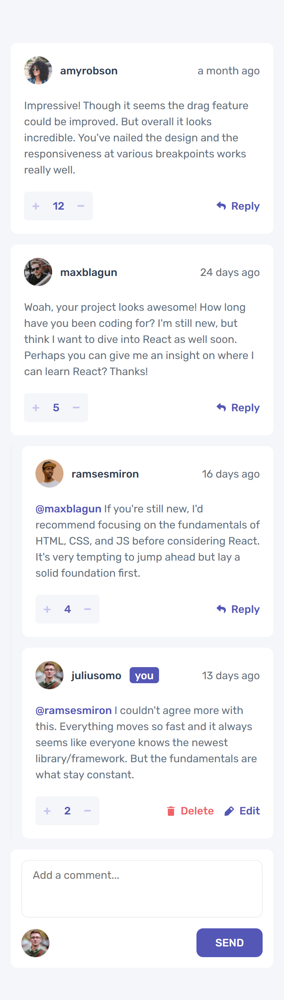
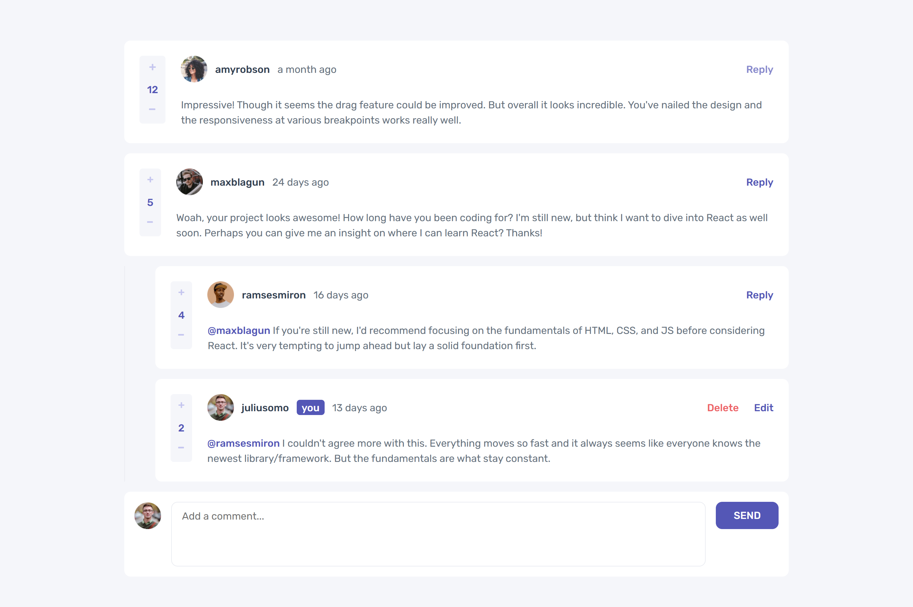

# Frontend Mentor - Interactive comments section solution

This is a solution to the [Interactive comments section challenge on Frontend Mentor](https://www.frontendmentor.io/challenges/interactive-comments-section-iG1RugEG9). Frontend Mentor challenges help you improve your coding skills by building realistic projects. 

## Table of contents

- [Overview](#overview)
  - [The challenge](#the-challenge)
  - [Screenshot](#screenshot)
  - [Links](#links)
- [My process](#my-process)
  - [Built with](#built-with)
  - [What I learned](#what-i-learned)
- [Author](#author)

## Overview

### The challenge

Users should be able to:

- View the optimal layout for the app depending on their device's screen size
- See hover states for all interactive elements on the page
- Create, Read, Update, and Delete comments and replies
- Upvote and downvote comments
- **Bonus**: If you're building a purely front-end project, use `localStorage` to save the current state in the browser that persists when the browser is refreshed.
- **Bonus**: Instead of using the `createdAt` strings from the `data.json` file, try using timestamps and dynamically track the time since the comment or reply was posted.

### Screenshot
Mobile

Desktop

### Links

- [Solution URL](https://github.com/jcnevess/interactive-comments-section/)
- [Live Site URL](https://interactive-comments-section-rho-eight.vercel.app/)

## My process

### Built with

- Semantic HTML5 markup
- CSS custom properties
- Flexbox
- Mobile-first workflow
- [React](https://reactjs.org/) - JS library
- [Next.js](https://nextjs.org/) - React framework

### What I learned

In this project I had the chance to learn how to use `localStorage` and exercise my understanding of 
Next.js `server` and `client` components.

At first, I used an prop drilling approach. I was difficult to follow and I became so overwhelmed
that I almost gave up on the challenge. But with some resilience I could get it done.

Next, I searched for better solutions and stumbled with two alternatives: `Redux` or React built-in `useReducer`.
Redux is a battle-tested state management tool, but I choose to learn built-in features first. 

I had some difficulties to make useReducer to work along `localStorage`, but after some search
and persistence I could get it done.

This was my first time using the `useContext` hook aswell. It was very useful for state management and to keep 
track of current user data.

Things that could be better: Every comment is ordered by score, even replies.

## Author

- Website - [Júlio Neves](https://jcnevess.github.io/)
- Frontend Mentor - [@jcnevess](https://www.frontendmentor.io/profile/jcnevess)
